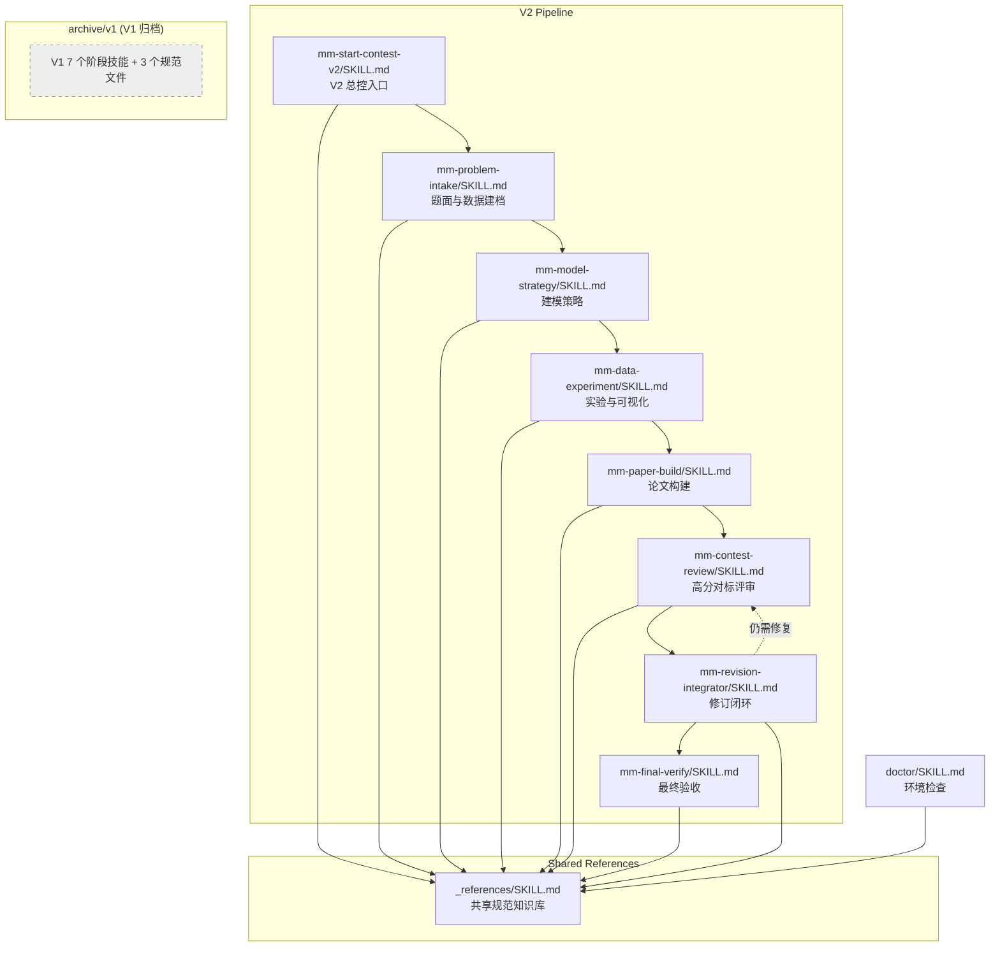

# 文件关系图谱与运行逻辑

> 本文档梳理 MathModelAgent 工作流中所有文件的依赖关系、调用链路和数据流向。
> 
> 最后更新：2026-07-01
>
> **V1 工作流已于 2026-07-01 归档** → [[archive/v1/README|V1 归档说明]]。V1 所有技能已移至 `archive/v1/skills/`，V1 专属规范文件已移至 `archive/v1/_references/`。当前仅 V2 工作流为活跃流程。

---

## 一、总体架构：V2 工作流

整个系统以 **V2**（高分论文导向，Skill + Codex 子代理混合工作流）为主流程：



---

## 二、文件分层关系

### 第 0 层：项目配置

| 文件 | 角色 | 被谁读取 |
|------|------|----------|
| [[CLAUDE.md]] | 项目级 AI 配置，概述 V2 架构 | 所有 AI Agent 首次进入项目时读取 |
| `mathmodelagent.skills.sh.json` | Skills 注册表（V2 技能 + 工具 + _references） | Obsidian/Codex 加载 skill 时读取 |
| `.claude/settings.local.json` | Claude Code 本地权限配置 | Claude Code 会话启动时读取 |
| [[archive/v1/README]] | V1 归档说明 | 需要了解 V1 历史的开发者 |

### 第 1 层：引用知识库 (`skills/_references/`)

所有技能和子代理共享的规范知识库，**不能独立执行**。

#### 核心契约（3 个）

| 文件 | 内容 | 被谁引用 |
|------|------|----------|
| [[skills/_references/v2_pipeline_contract.md]] | V2 工作流契约：阶段门禁、必需产物、完成定义 | 所有 V2 技能 |
| [[skills/_references/workflow_state_contract.md]] | 持久化上下文契约：档案列表、阶段门禁、RESULT_MANIFEST/CLAIM_TRACE 结构 | V2 技能（继承作为档案结构参考，V1 已归档） |
| [[skills/_references/codex_subagent_protocol.md]] | 子代理角色定义、并行规则、权限继承、日志格式 | V2 技能中使用子代理时 |

#### 评分与质量标准（4 个）

| 文件                                                | 内容                                       | 被谁引用                                  |
| ------------------------------------------------- | ---------------------------------------- | ------------------------------------- |
| [[skills/_references/contest_score_rubric.md]]    | 10 维度 0-5 分评分标准与硬失败条件                    | `mm-contest-review`、`mm-final-verify` |
| [[skills/_references/paper_benchmark_profile.md]] | 弱论文-高分论文差距画像与最低质量线                       | `mm-paper-build`、`mm-contest-review`  |
| [[skills/_references/figure_quality_standard.md]] | 图表元数据要求、质量标准                             | `mm-data-experiment`、`mm-paper-build` |
| [[skills/_references/agent_review_protocol.md]]   | 统一评审格式（PASS/CONDITIONAL_PASS/FAIL + 严重度） | 所有评审阶段                                |

#### 领域知识（2 个）

| 文件                                            | 内容                      | 被谁引用                                     |
| --------------------------------------------- | ----------------------- | ---------------------------------------- |
| [[archive/v1/_references/math_modeling_norms.md]] | 数学建模规范：题型防错、假设、模型分类、写作等（V1 归档） | 仅归档参考 |
| [[skills/_references/model_method_cards.md]]  | 模型选型卡片：预测、评价、优化、图论等     | `mm-model-strategy` |

#### 可选集成（2 个）

| 文件 | 内容 | 被谁引用 |
|------|------|----------|
| [[skills/_references/nature_figure_integration_guide.md]] | Nature-Figure 科研绘图接入指南 | `mm-model-strategy`、`mm-data-experiment`、`mm-paper-build`、`mm-contest-review`、`mm-final-verify` |
| [[skills/_references/ars_v2_integration_guide.md]] | ARS 学术评审套件接入指南 | 同上所有 V2 技能 |

#### 外部监控（1 个，已归档）

| 文件 | 内容 | 被谁引用 |
|------|------|----------|
| [[archive/v1/_references/claude_code_monitoring.md]] | 长流程 AI 监控、风险登记规范（V1 归档） | 仅归档参考 |

#### 脚本（3 个）

| 文件 | 用途 | 被谁调用 |
|------|------|----------|
| [[archive/v1/_references/check_context_contract.py]] | 检查 V1 持久化上下文文件是否齐全（V1 归档） | 仅归档参考 |
| [[skills/_references/scripts/audit_v2_run.py]] | V2 只读审计：PNG-only 图、Pillow 数据图、缺失矢量包、短论文误判 PASS | `mm-final-verify` |
| [[skills/_references/scripts/resolve_nature_figure.py]] | 定位并验证 nature-figure 安装 | `mm-data-experiment`、`doctor` |

### 第 2A 层：V2 技能（7 个，按阶段顺序）

每个 V2 技能包含 `SKILL.md` + `agents/openai.yaml`：

| 技能                                         | 输入           | 输出                                                                                                                                                                | 子代理                                                               | 门禁文件                                       |
| ------------------------------------------ | ------------ | ----------------------------------------------------------------------------------------------------------------------------------------------------------------- | ----------------------------------------------------------------- | ------------------------------------------ |
| [[skills/mm-start-contest-v2/SKILL.md]]    | 用户偏好         | `plan.md`, `todo.md`, `WORKFLOW_STATE.md`                                                                                                                         | 无（纯编排）                                                            | 无                                          |
| [[skills/mm-problem-intake/SKILL.md]]      | 赛题 + 附件      | `PROBLEM_BRIEF.md`, `DATA_AUDIT.md`, `INTAKE_GATE.md`                                                                                                             | `problem-analyst` + `data-auditor`                                | [[INTAKE_GATE]]                            |
| [[skills/mm-model-strategy/SKILL.md]]      | 题面 + 数据      | `MODEL_CANDIDATES.md`, `MODEL_REVIEW_AI.md`, `HUMAN_MODEL_REVIEW.md`, `MODELING_DECISION.md`, `ANALYSIS_MODELING_REPORT.md`, `ANALYSIS_GATE.md`, `FIGURE_PLAN.md` | `model-reviewer` + `devils-advocate`                              | [[ANALYSIS_GATE]] + [[HUMAN_MODEL_REVIEW]] |
| [[skills/mm-data-experiment/SKILL.md]]     | 建模决策 + 已确认路线 | `code/`, `results/RESULTS_MANIFEST.json`, `figures/`, `EXPERIMENT_LOG.md`, `RESULTS_REPORT.md`, `FIGURE_AUDIT.md`                                                 | `experiment-coder` + `visualization-reviewer`                     | FIGURE_AUDIT                               |
| [[skills/mm-paper-build/SKILL.md]]         | 代码结果 + 图表    | `paper/`, `CLAIM_TRACE.md`, `METHOD_IMPLEMENTATION_MATRIX.md`, `PAPER_BUILD_REPORT.md`                                                                            | `paper-writer`                                                    | METHOD_IMPLEMENTATION_MATRIX               |
| [[skills/mm-contest-review/SKILL.md]]      | 全部产物         | `PAPER_SCORECARD.md`, `REVISION_ACTIONS.md`                                                                                                                       | `contest-reviewer` + `devils-advocate` + `visualization-reviewer` | PAPER_SCORECARD                            |
| [[skills/mm-revision-integrator/SKILL.md]] | 评分 + 修订清单    | 修订后的各文件 + `REVISION_STATUS.md`                                                                                                                                    | 无（直接修改）                                                           | REVISION_STATUS                            |
| [[skills/mm-final-verify/SKILL.md]]        | 全部产物         | `VERIFY_REPORT.md`                                                                                                                                                | `final-integrator`（可选）                                            | VERIFY_REPORT                              |

### 第 2B 层：V1 技能（7 个，已归档至 `archive/v1/skills/`）

V1 技能已于 2026-07-01 归档。详见 [[archive/v1/README|V1 归档说明]]。各技能现在位于：

| 技能 | 归档路径 | 说明 |
|------|---------|------|
| 0problem-triage | `archive/v1/skills/0problem-triage/SKILL.md` | 赛题预审 |
| 1start-mathmodel | `archive/v1/skills/1start-mathmodel/SKILL.md` | V1 总控入口 |
| 2analysis-modeling | `archive/v1/skills/2analysis-modeling/SKILL.md` | 分析与建模 |
| 3coding-visual | `archive/v1/skills/3coding-visual/SKILL.md` | 代码与图表 |
| 4drawio | `archive/v1/skills/4drawio/SKILL.md` | 流程图 |
| 5writing | `archive/v1/skills/5writing/SKILL.md` | 论文撰写 |
| 6verity | `archive/v1/skills/6verity/SKILL.md` | 验证验收 |

V1 专属规范文件归档路径：
- `archive/v1/_references/math_modeling_norms.md` — 数学建模规范
- `archive/v1/_references/claude_code_monitoring.md` — 长流程监控规范
- `archive/v1/_references/check_context_contract.py` — 上下文检查脚本
- `archive/v1/skills/6verity/scripts/writing_check.sh` — 论文质量检查脚本

### 第 3 层：工具技能（1 个）

| 技能 | 用途 |
|------|------|
| [[skills/doctor/SKILL.md]] | 环境检查与安装向导（手动触发，不自动执行） |

---

## 三、子代理角色配置（`skills/_references/agent_profiles/`）

10 个子代理角色，被 V2 技能按需加载：

| 代理配置文件 | 角色 | 权限 | 推理强度 | 被哪些技能调用 |
|-------------|------|------|----------|---------------|
| [[skills/_references/agent_profiles/problem-analyst.md]] | 独立解析赛题 | 只读 | medium | `mm-problem-intake` |
| [[skills/_references/agent_profiles/data-auditor.md]] | 审计数据质量 | 只读 | medium | `mm-problem-intake` |
| [[skills/_references/agent_profiles/model-strategist.md]] | 设计候选建模路线 | 写 reports/ | high | `mm-model-strategy` |
| [[skills/_references/agent_profiles/model-reviewer.md]] | 评审模型可行性 | 只读 | high | `mm-model-strategy`, `mm-contest-review` |
| [[skills/_references/agent_profiles/devils-advocate.md]] | 攻击薄弱点、找反对意见 | 只读 | high | `mm-model-strategy`, `mm-contest-review` |
| [[skills/_references/agent_profiles/experiment-coder.md]] | 实现代码、运行实验 | 写 code/results/figures/reports | high | `mm-data-experiment` |
| [[skills/_references/agent_profiles/visualization-reviewer.md]] | 审查图表质量 | 只读 | medium | `mm-data-experiment`, `mm-contest-review` |
| [[skills/_references/agent_profiles/paper-writer.md]] | 撰写/修订论文 | 写 paper/ + CLAIM_TRACE | high | `mm-paper-build`, `mm-contest-review` |
| [[skills/_references/agent_profiles/contest-reviewer.md]] | 按高分标准评分 | 只读 | high | `mm-contest-review` |
| [[skills/_references/agent_profiles/final-integrator.md]] | 整合修订、最终一致性 | 写 paper/ + reports | high | `mm-final-verify` |

### 代理命名映射

当 Codex 注册了自定义代理时，使用 `mathmodel-*` 前缀：

| Profile | 自定义代理名 |
|---------|------------|
| `problem-analyst` | `mathmodel-problem-analyst` |
| `data-auditor` | `mathmodel-data-auditor` |
| `model-strategist` | `mathmodel-strategist` |
| `model-reviewer` | `mathmodel-reviewer` |
| `devils-advocate` | `mathmodel-devils-advocate` |
| `experiment-coder` | `mathmodel-experiment-coder` |
| `visualization-reviewer` | `mathmodel-visualization-reviewer` |
| `paper-writer` | `mathmodel-paper-writer` |
| `contest-reviewer` | `mathmodel-contest-reviewer` |
| `final-integrator` | `mathmodel-final-integrator` |

---

## 四、V2 工作流完整执行逻辑

### Phase 0: 启动 → [[skills/mm-start-contest-v2/SKILL.md]]

```
┌─ 读取 _references:
│   ├── v2_pipeline_contract.md          ← 了解阶段门禁和必需产物
│   ├── codex_subagent_protocol.md       ← 了解子代理角色和并行规则
│   ├── contest_score_rubric.md          ← 了解评分维度
│   └── paper_benchmark_profile.md        ← 了解论文质量基准
│
├─ 创建骨架文件:
│   ├── plan.md                          ← 嵌入用户偏好（引擎/竞赛类型/语言）
│   ├── todo.md                          ← 7 阶段清单
│   └── WORKFLOW_STATE.md                ← 当前阶段=phase 0
│
└─ 依次调度 Phase 1-6
```

### Phase 1: 题面建档 → [[skills/mm-problem-intake/SKILL.md]]

```
┌─ 前置检查: 赛题 PDF/DOCX/CSV 等所有附件
│
├─ 并行启动子代理 (独立评审):
│   ├── problem-analyst  ──→ 识别子问题、目标、约束、歧义
│   └── data-auditor     ──→ 审计字段、单位、缺失值、异常值
│
├─ 整合结果:
│   ├── PROBLEM_BRIEF.md   ← 题面重述+子问题+输入输出
│   └── DATA_AUDIT.md      ← 附件清单+字段+风险
│
├─ 写门禁: reports/INTAKE_GATE.md  (PASS/CONDITIONAL_PASS/FAIL)
│
└─ 记录子代理运行: reports/AGENT_RUNS.md
```

### Phase 2: 建模策略 → [[skills/mm-model-strategy/SKILL.md]]

```
┌─ 读取输入:
│   ├── PROBLEM_BRIEF.md, DATA_AUDIT.md, INTAKE_GATE.md
│   └── _references/model_method_cards.md  ← 模型选型参考
│
├─ 生成候选路线:
│   └── reports/MODEL_CANDIDATES.md  ← 至少 2 条路线(保守+高分)
│
├─ 并行独立评审:
│   ├── model-reviewer    ──→ 评正确性/可行性/数据匹配度
│   ├── devils-advocate   ──→ 找薄弱假设/模板化/缺失验证
│   └── (可选) ARS methodology audit
│       └── reports/MODEL_REVIEW_AI.md  ← 综合评审结论
│
├─ ★ 人工确认门禁 (必须):
│   └── reports/HUMAN_MODEL_REVIEW.md   ← 用户确认最终路线
│
├─ 写决策文件:
│   └── reports/MODELING_DECISION.md    ← 最终采用的建模路线
│
├─ 写建模报告:
│   ├── reports/ANALYSIS_MODELING_REPORT.md  ← 公式+算法+任务清单
│   └── reports/FIGURE_PLAN.md              ← 每张图的用途和计划
│
└─ 写门禁: reports/ANALYSIS_GATE.md  (PASS/CONDITIONAL_PASS/FAIL)
    └── 门禁条件: 人工确认存在 + 公式可实施 + 有验证 + 有图表计划
```

### Phase 3: 代码实验 → [[skills/mm-data-experiment/SKILL.md]]

```
┌─ 前置条件: HUMAN_MODEL_REVIEW.md 必须存在（否则停止）
│
├─ 读取输入:
│   ├── MODELING_DECISION.md, ANALYSIS_MODELING_REPORT.md, ANALYSIS_GATE.md
│   └── _references/figure_quality_standard.md
│
├─ 执行顺序:
│   ├── EDA (数据探索)
│   ├── ques1 → ques2 → ... → quesN  (逐子问题)
│   └── sensitivity_analysis (敏感性分析)
│
├─ 每个子问题:
│   ├── 写代码 → 语法检查 → 运行 → 保存输出
│   ├── 生成图表 (PDF/SVG 矢量，不用 Pillow)
│   ├── 写结果叙述 → reports/RESULTS_REPORT.md
│   ├── 写 manifest 条目 → results/RESULTS_MANIFEST.json
│   └── 写实验日志 → reports/EXPERIMENT_LOG.md
│
├─ 子代理:
│   ├── experiment-coder          ← 写代码+运行实验
│   └── visualization-reviewer    ← 审查图表质量
│
├─ 图表审计:
│   └── reports/FIGURE_AUDIT.md   ← 检查可读性/标签/矢量导出
│       └─ 若有 FAIL 图 → 写入 REVISION_ACTIONS.md 作为 HIGH/BLOCKER
│
└─ 更新 WORKFLOW_STATE.md → current_stage = experiment
```

### Phase 4: 论文构建 → [[skills/mm-paper-build/SKILL.md]]

```
┌─ 读取输入:
│   ├── ANALYSIS_MODELING_REPORT.md, MODELING_DECISION.md
│   ├── RESULTS_REPORT.md, FIGURE_PLAN.md, RESULTS_MANIFEST.json
│   ├── figures/  目录
│   └── _references/paper_benchmark_profile.md
│
├─ 确定引擎: LaTeX / Typst (从 plan.md 读取，默认 LaTeX)
│   └─ 从 5writing/templates/ 选择匹配模板
│
├─ 构建方法实施矩阵:
│   └── reports/METHOD_IMPLEMENTATION_MATRIX.md
│       └─ 比较: 批准路线 vs 代码实现 vs 论文措辞
│           ├── implemented / downgraded_with_disclosure / not_implemented
│           └── not_implemented 禁止最终通过
│
├─ 撰写论文:
│   ├── 逐子问题撰写 (必须在实验结果存在后)
│   ├── 按 FIGURE_PLAN.md 插入图表
│   ├── 写结论追踪: reports/CLAIM_TRACE.md
│   │   └─ 每个声明: strong/acceptable/weak/missing
│   │       └─ weak 核心声明必须措辞谨慎
│   └── 摘要最后写 (引用最终方法和数值)
│
├─ 子代理:
│   └── paper-writer  ← 写 paper/ 目录内容
│
├─ 质量门禁 (硬性):
│   ├── 不能是纯文字稿 (必须插入图表)
│   ├── 每个核心子问题至少一张图
│   ├── 不能编造数值
│   ├── 正文字数 ≥ 8 页 (4+ 子问题时)
│   ├── 包含非数据方法流程图
│   └── 不泄露内部文件名 (reports/, WORKFLOW_STATE.md 等)
│
└─ 写构建报告: reports/PAPER_BUILD_REPORT.md
```

### Phase 5: 评审 → [[skills/mm-contest-review/SKILL.md]]

```
┌─ 读取输入: 全部产物 (10+ 文件)
│   └─ _references/contest_score_rubric.md
│
├─ 独立评审面板 (并行):
│   ├── contest-reviewer        ← 10 维度评分 (0-5)
│   ├── devils-advocate         ← 找薄弱点和评委反对意见
│   ├── visualization-reviewer  ← 图表质量审查
│   ├── paper-writer            ← 结构/行文评审
│   ├── model-reviewer          ← 批准路线 vs 实现一致性
│   └── (可选) ARS editorial synthesizer ← 综合面板意见
│
├─ 产出:
│   ├── reports/PAPER_SCORECARD.md     ← 评分+结论 (PASS/CONDITIONAL_PASS/FAIL)
│   │   └─ 任何维度 < 4 → 必须创建修订项
│   └── reports/REVISION_ACTIONS.md    ← 修订清单
│       ├── 严重度: BLOCKER > HIGH > MEDIUM > LOW
│       └── 默认状态: unresolved
│
├─ 审计:
│   ├── 图表审计 (插入/可读/标签/矢量)
│   ├── 方法实施矩阵 (not_implemented 至少 HIGH)
│   ├── 声明强度 (missing 核心声明 = 硬失败)
│   └── 论文密度 (4+ 子问题 < 8 页 = HIGH)
│
└─ 硬失败条件:
    ├── 论文无图 / 图未插入
    ├── 核心声明无法追踪
    ├── 模型路线从未评审
    ├── 代码结果与论文声明不匹配
    ├── 缺失敏感性/验证分析
    └── 批准路线与实现严重不符
```

### Phase 5: 修订闭环 → [[skills/mm-revision-integrator/SKILL.md]]

```
┌─ 前置条件: PAPER_SCORECARD 或 REVISION_ACTIONS 中存在
│   BLOCKER / HIGH / MEDIUM / weak-claim / figure-audit / method-implementation 问题
│
├─ 读取 REVISION_ACTIONS.md 中每一项:
│   ├── BLOCKER/HIGH → 必须先修复才能进入最终验收
│   └── MEDIUM → 影响清晰度/可信度的也要修
│
├─ 修复方式:
│   ├── 代码修改 → 重新运行 → 更新结果
│   ├── 论文修改 → 重新编译
│   ├── 图表重新生成 → 更新 FIGURE_AUDIT
│   ├── 方法降级 → 更新 MODELING_DECISION + MATRIX + 论文措辞
│   └── 弱声明 → 加强证据 或 改写为谨慎措辞
│
├─ 记录修订状态:
│   └── reports/REVISION_STATUS.md
│       ├── resolved / carried_with_justification / unresolved
│       └── BLOCKER/HIGH 不能 carried_with_justification
│
└─ 完成后可能需要重回 Phase 5 重新评审
```

### Phase 6: 最终验收 → [[skills/mm-final-verify/SKILL.md]]

```
┌─ 运行自动审计:
│   └── python skills/_references/scripts/audit_v2_run.py --workspace <path>
│       └─ BLOCKER/HIGH 发现 → 复制到 VERIFY_REPORT + REVISION_ACTIONS
│
├─ 检查清单 (50+ 项):
│   ├── 全部必需文件存在
│   ├── HUMAN_MODEL_REVIEW 确认了最终路线
│   ├── RESULTS_MANIFEST.json 有 metrics 和 figures
│   ├── METHOD_IMPLEMENTATION_MATRIX 无 not_implemented
│   ├── FIGURE_AUDIT 无 FAIL 状态
│   ├── CLAIM_TRACE 无 missing 声明 / 无 strongly worded weak 声明
│   ├── PAPER_SCORECARD 全部维度 ≥ 4
│   ├── REVISION_ACTIONS 无未解决的 BLOCKER/HIGH
│   ├── 代码可运行 / 论文可编译
│   ├── 未泄露内部文件名
│   └── 论文 PDF 可打开且无空白页
│
├─ (可选) ARS integrity check + claim faithfulness check
│
├─ 结论: reports/VERIFY_REPORT.md
│   ├── PASS: 全部维度 ≥ 4, 无 BLOCKER/HIGH, 图可读, 方法诚实, 声明可追踪
│   ├── CONDITIONAL_PASS: 硬门禁通过，仅剩 MEDIUM/LOW
│   └── FAIL: 任一硬门禁失败
│
└─ 只有当 VERIFY_REPORT.md = PASS 时，项目才算完成
```

---

## 五、V1 工作流（已归档，仅供参考）

V1 为线性管道流程，已于 2026-07-01 归档至 `archive/v1/`。以下为 V1 阶段概览：

```
0problem-triage (赛题预审) → 2analysis-modeling (分析与建模) → 3coding-visual (代码实现)
→ 4drawio (流程图) → 5writing (论文撰写) → 6verity (验证验收)
```

V1 详细执行逻辑和文件说明见归档目录 [[archive/v1/README|V1 归档说明]]。

---
## 六、V1 与 V2 的关键差异（V1 已归档）

| 维度 | V1 (已归档) | V2 (当前活跃) |
|------|----|----|
| 编排方式 | 线性顺序执行 | 混合 Skill + Codex 子代理 |
| 人工确认 | 无强制确认点 | Phase 1 必须人工确认建模路线 |
| 评分体系 | 无 | 10 维度 0-5 评分 |
| 修订流程 | 手动修复后重跑 | 正式修订闭环 (mm-revision-integrator) |
| 子代理 | 无 | 10 个独立评审角色 |
| 图表审计 | 基础检查 | 多维度审计 (矢量/后端/可读) |
| 门禁文件 | 3 个 (TRIAGE/ANALYSIS/VERIFY) | 11 个 (含 INTAKE/FIGURE/METHOD/SCORECARD 等) |
| 完成标准 | VERIFY_REPORT = PASS | 全部维度 ≥ 4 + 无 BLOCKER/HIGH |

---

## 七、文件读取依赖矩阵（V2 完整流程）

下表列出每个 V2 阶段的 "Load First" 必需读取和实际读取的参考文件：

| 参考文件                                 | Phase 0 | Phase 1 | Phase 2 | Phase 3 | Phase 4 | Phase 5 | Phase 6 |
| ------------------------------------ | :-----: | :-----: | :-----: | :-----: | :-----: | :-----: | :-----: |
| `v2_pipeline_contract.md`            |    ✓    |    ✓    |    ✓    |    ✓    |    ✓    |    ✓    |    ✓    |
| `codex_subagent_protocol.md`         |    ✓    |    ✓    |    ✓    |    ✓    |    ·    |    ·    |    ·    |
| `contest_score_rubric.md`            |    ✓    |    ·    |    ·    |    ·    |    ✓    |    ✓    |    ✓    |
| `paper_benchmark_profile.md`         |    ✓    |    ·    |    ·    |    ✓    |    ✓    |    ·    |    ·    |
| `figure_quality_standard.md`         |    ·    |    ·    |    ✓    |    ✓    |    ✓    |    ✓    |    ✓    |
| `agent_review_protocol.md`           |    ·    |    ✓    |    ·    |    ·    |    ✓    |    ✓    |    ✓    |
| `model_method_cards.md`              |    ·    |    ✓    |    ·    |    ·    |    ·    |    ·    |    ·    |
| `nature_figure_integration_guide.md` |    △    |    ·    |    △    |    △    |    △    |    △    |    △    |
| `ars_v2_integration_guide.md`        |    △    |    ·    |    △    |    △    |    △    |    △    |    △    |

> ✓ = 必需读取, · = 不读取, △ = 可选 (条件读取)

---

## 八、数据流：从输入到输出的完整追踪

```
赛题文件 (PDF/DOCX/CSV)
  │
  ├─→ [Phase 0: mm-problem-intake]
  │     ├─→ PROBLEM_BRIEF.md   ← 题面结构化
  │     └─→ DATA_AUDIT.md      ← 数据质量审计
  │
  ├─→ [Phase 1: mm-model-strategy]
  │     ├─→ MODEL_CANDIDATES.md    ← 候选路线
  │     ├─→ MODEL_REVIEW_AI.md     ← AI 评审
  │     ├─→ HUMAN_MODEL_REVIEW.md  ← ★ 人工确认
  │     ├─→ MODELING_DECISION.md   ← 最终决策
  │     ├─→ ANALYSIS_MODELING_REPORT.md  ← 公式+算法
  │     └─→ FIGURE_PLAN.md         ← 图表计划
  │
  ├─→ [Phase 2: mm-data-experiment]
  │     ├─→ code/*.py              ← 可复现代码
  │     ├─→ code/outputs/          ← 中间输出
  │     ├─→ figures/*.pdf          ← 数据图表
  │     ├─→ results/RESULTS_MANIFEST.json  ← 关键数值索引
  │     ├─→ RESULTS_REPORT.md      ← 结果叙述
  │     ├─→ EXPERIMENT_LOG.md      ← 实验日志
  │     └─→ FIGURE_AUDIT.md        ← 图表审计
  │
  ├─→ [Phase 3: mm-paper-build]
  │     ├─→ paper/main.tex (或 .typ)  ← 模板来自 skills/5writing/templates/（V2 唯一硬依赖）
  │     ├─→ CLAIM_TRACE.md            ← 声明→证据映射
  │     ├─→ METHOD_IMPLEMENTATION_MATRIX.md  ← 方法实施对照
  │     └─→ PAPER_BUILD_REPORT.md     ← 构建总结
  │
  ├─→ [Phase 4: mm-contest-review]
  │     ├─→ PAPER_SCORECARD.md    ← 10 维度评分
  │     └─→ REVISION_ACTIONS.md   ← 修订清单
  │
  ├─→ [Phase 5: mm-revision-integrator]
  │     └─→ REVISION_STATUS.md    ← 修订状态追踪
  │
  └─→ [Phase 6: mm-final-verify]
        └─→ VERIFY_REPORT.md      ← 最终验收结论 (PASS/CONDITIONAL_PASS/FAIL)
```

---

## 九、关键门禁决策树

```
START
  │
  ├─ INTAKE_GATE = FAIL? ──→ 停止，修复题面/数据问题
  │
  ├─ HUMAN_MODEL_REVIEW 不存在? ──→ 停止，等待人工确认
  │
  ├─ ANALYSIS_GATE = FAIL? ──→ 停止，修复建模问题
  │
  ├─ 任何子问题无结果? ──→ 停止，补全实验
  │
  ├─ METHOD_IMPLEMENTATION_MATRIX 有 not_implemented? ──→ 停止，修复或诚实降级
  │
  ├─ FIGURE_AUDIT 有 FAIL 图? ──→ 停止，修复图表
  │
  ├─ CLAIM_TRACE 有 missing 核心声明? ──→ 停止，补充证据或降级声明
  │
  ├─ PAPER_SCORECARD 有维度 < 4? ──→ 创建 REVISION_ACTION
  │
  ├─ REVISION_ACTIONS 有未解决的 BLOCKER/HIGH? ──→ 进入 mm-revision-integrator
  │
  └─ audit_v2_run.py 报告 BLOCKER/HIGH? ──→ 修复后重跑
        │
        └─→ VERIFY_REPORT = PASS ✓  项目完成
```

---

## 十、模板系统（`skills/5writing/templates/`）

双引擎覆盖 17 种竞赛类型。这是 V2 论文阶段的唯一硬依赖（从 V1 继承，模板自身未归档）：

| 语言 | 竞赛 | Typst 模板 | LaTeX 模板 |
|------|------|-----------|-----------|
| 中文 | 国赛/CUMCM | `zh/cumcm/` | `zh/cumcm-latex/` |
| 中文 | 华为杯 | `zh/huaweibei/` | `zh/huaweibei-latex/` |
| 中文 | 华中杯 | `zh/huazhongbei/` | `zh/huazhongbei-latex/` |
| 中文 | 长三角 | `zh/changsanjiao/` | `zh/changsanjiao-latex/` |
| 中文 | MathorCup | `zh/mathorcup/` | `zh/mathorcup-latex/` |
| 中文 | 电工杯 | `zh/diangongbei/` | `zh/diangongbei-latex/` |
| 中文 | 东三省 | `zh/dongsansheng/` | `zh/dongsansheng-latex/` |
| 中文 | APMCM | `zh/apmcm/` | `zh/apmcm-latex/` |
| 中文 | MCM | `zh/mcm/` | `zh/mcm-latex/` |
| 中文 | 华数杯 | `zh/huashubei/` | `zh/huashubei-latex/` |
| 中文 | 数维杯 | `zh/shuweibei/` | `zh/shuweibei-latex/` |
| 中文 | 五一杯 | `zh/wuyibei/` | `zh/wuyibei-latex/` |
| 中文 | 统计建模 | `zh/stats/` | `zh/stats-latex/` |
| 中文 | 默认 | `zh/default/` | `zh/default-latex/` |
| 英文 | MCM/ICM | `en/mcm/` | `en/mcm-latex/` |
| 英文 | APMCM | `en/apmcm/` | `en/apmcm-latex/` |
| 英文 | 默认 | `en/default/` | `en/default-latex/` |

---

## 十一、文件快速索引

### 总控入口
- [[CLAUDE.md]] — 项目级 AI 配置
- [[skills/mm-start-contest-v2/SKILL.md]] — V2 总控入口
- [[archive/v1/README]] — V1 归档说明

### 共享知识库中枢
- [[skills/_references/SKILL.md]] — 引用知识库索引

### V2 核心契约（必读）
- [[skills/_references/v2_pipeline_contract.md]] — V2 工作流契约
- [[skills/_references/workflow_state_contract.md]] — 持久化上下文契约
- [[skills/_references/codex_subagent_protocol.md]] — 子代理协议

### V2 评分标准
- [[skills/_references/contest_score_rubric.md]] — 评分维度
- [[skills/_references/paper_benchmark_profile.md]] — 论文质量标准
- [[skills/_references/figure_quality_standard.md]] — 图表质量标准
- [[skills/_references/agent_review_protocol.md]] — 评审格式

### V2 建模参考
- [[skills/_references/model_method_cards.md]] — 模型选型卡片

### V2 可选增强
- [[skills/_references/nature_figure_integration_guide.md]] — Nature 科研绘图
- [[skills/_references/ars_v2_integration_guide.md]] — ARS 学术评审

### 工具
- [[skills/doctor/SKILL.md]] — 环境检查
- [[skills/_references/scripts/audit_v2_run.py]] — V2 自动审计
- [[skills/_references/scripts/resolve_nature_figure.py]] — Nature-Figure 定位

### V1 归档
- [[archive/v1/README]] — V1 归档说明
- [[archive/v1/_references/math_modeling_norms.md]] — 数学建模规范（V1 归档）
- [[archive/v1/_references/claude_code_monitoring.md]] — 长流程监控（V1 归档）
- [[archive/v1/_references/check_context_contract.py]] — 上下文检查脚本（V1 归档）
- [[archive/v1/skills/6verity/scripts/writing_check.sh]] — 论文质量检查（V1 归档）

---

## 十二、V1 与 V2 耦合关系（归档时记录）

> **V1 已于 2026-07-01 归档**。以下为归档时的耦合分析快照，供历史参考。

### V2 对 V1 的唯一硬依赖

```
skills/5writing/templates/   ←── 被 V2 的 mm-paper-build 直接复用
├── zh/cumcm/              ←── V2 从 plan.md 读竞赛类型 → 选模板
├── zh/cumcm-latex/
├── en/mcm/
└── ... (34 套模板)
```

这是 V1 和 V2 之间唯一的深层耦合：**V2 论文阶段的模板选择逻辑依赖此模板目录**。该目录在归档中**保留在原位**，未移动。

### 归属分析（归档时）

| 文件 | V1 引用 | V2 引用 | 处理 |
|------|:-------:|:-------:|------|
| `workflow_state_contract.md` | ✅ 核心 | ✅ 次级 | **保留**，添加版本标记 |
| `math_modeling_norms.md` | ✅ 核心 | ❌ | **归档** `archive/v1/_references/` |
| `claude_code_monitoring.md` | ✅ 引用 | ❌ | **归档** `archive/v1/_references/` |
| `model_method_cards.md` | ✅ 引用 | ✅ 引用 | **保留**，移除 V1 wikilink |
| `scripts/check_context_contract.py` | ✅ 引用 | ❌ | **归档** `archive/v1/_references/` |
| `6verity/scripts/writing_check.sh` | ✅ 引用 | ❌ | **归档** `archive/v1/skills/6verity/scripts/` |
| `5writing/templates/` | ✅ | ✅ | **保留**，V2 唯一硬依赖 |
| `doctor/SKILL.md` | ✅ | ✅ | **保留**，双方共用工具 |
