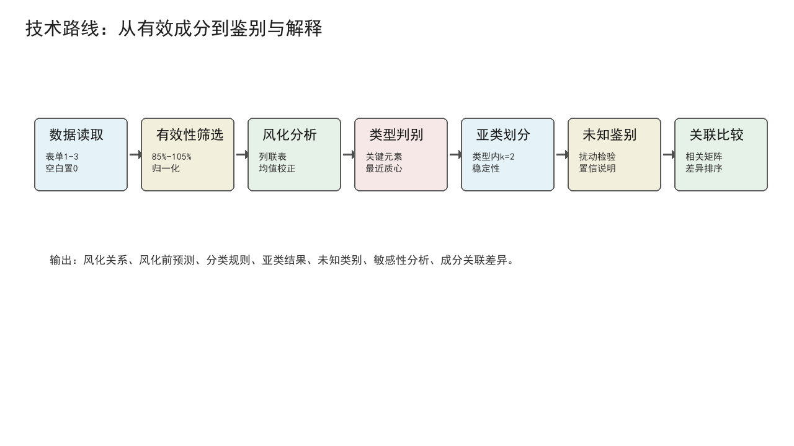
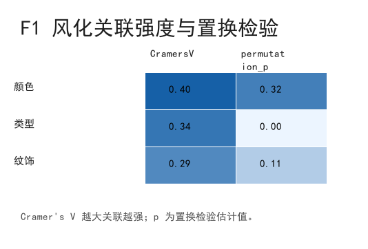
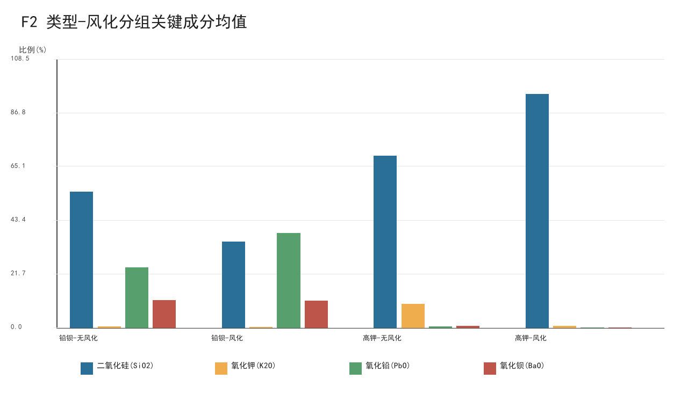
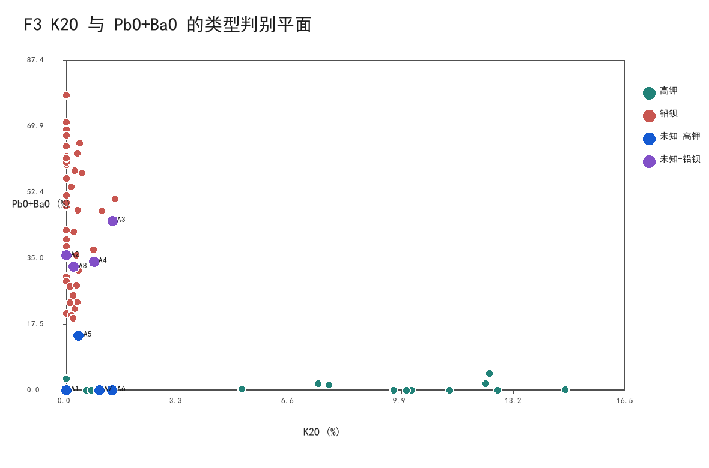
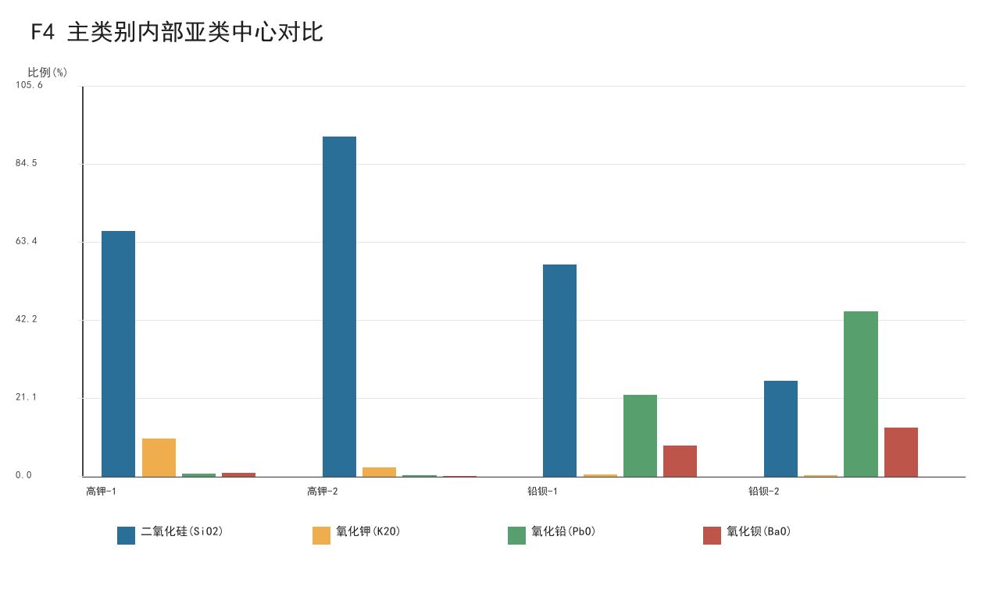
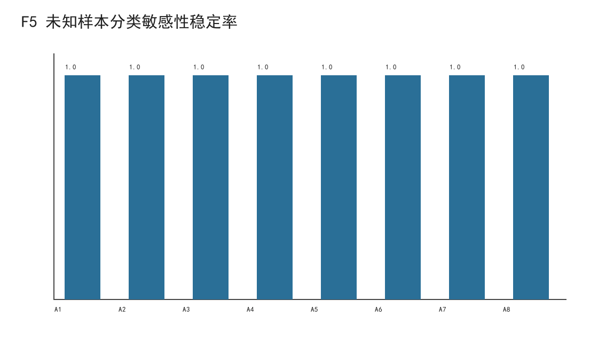
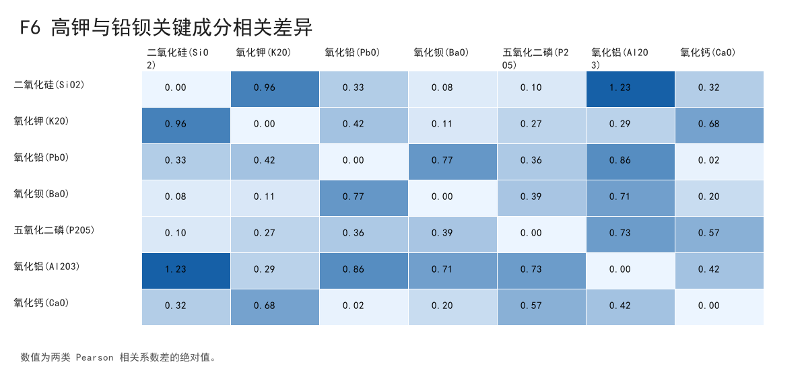

# 古代玻璃制品的成分分析与鉴别

## 摘要

针对古代玻璃制品的风化影响、类型鉴别、亚类划分和成分关联问题，本文建立了基于有效性筛选、成分归一化、置换关联检验、类型内风化校正、可解释判别和稳定性聚类的组合模型。首先按题设将成分总和位于 85% 到 105% 的样本视为有效，得到已分类有效采样点 67 个；空白成分按未检出处理并归一化到 100%。在风化关系上，玻璃类型与风化的关联达到 Cramer's V=0.344，置换检验 p=0.005，说明类型是更稳定的解释变量。其次，以 SiO2、K2O、PbO、BaO、P2O5、Al2O3、CaO 等关键成分建立最近质心判别模型，留一交叉验证准确率为 0.955。对未知样本 A1-A8 判别得到 A1、A5、A6、A7 为高钾玻璃，A2、A3、A4、A8 为铅钡玻璃；在 ±5% 成分扰动下平均稳定率为 1.000。最后，分别比较高钾和铅钡玻璃的成分相关矩阵，发现 SiO2-Al2O3、SiO2-K2O、PbO-BaO 等元素对的关联差异突出。模型结果可解释性强，并对风化校正、亚类划分和相关性解释的局限进行了说明。

**关键词：** 古代玻璃；风化校正；成分数据；最近质心判别；聚类分析；敏感性分析

## 1 问题重述

题目给出古代玻璃文物的基本信息、已分类样品成分比例和未知样品成分比例。需要分析表面风化与类型、纹饰、颜色的关系，预测风化前成分；提取高钾玻璃与铅钡玻璃的分类规律并划分亚类；鉴别未知类别样本；比较不同类别内化学成分之间的关联关系。

## 2 数据处理与基本假设

设样品原始成分为 x_j，空白项表示未检测到该成分，取值为 0。成分总和 S=Σx_j。按题设保留 85≤S≤105 的采样点，并归一化 z_j=100x_j/S。表单 2 中采样点 15 和 17 的成分总和低于 85，因此不进入核心训练；表单 3 的 8 个未知样本均为有效样本。

主要假设包括：同一类型玻璃的风化平均迁移方向可由风化与未风化样品均值差估计；小样本下优先采用可解释低方差模型；成分相关性反映组成关联特征，不直接解释为化学因果。

## 3 问题一：风化关系与风化前成分预测

对类型、纹饰、颜色分别与表面风化建立列联表，并计算 Cramer's V。结果见表 1。颜色的 V 值较高但置换 p 值较大，受颜色缺失和类别分散影响；类型的 p 值最低，说明类型与风化关系更稳定。

表 1 风化关联强度

| 变量 | CramersV | permutation_p | 样本数 |
| --- | --- | --- | --- |
| 颜色 | 0.403 | 0.319 | 58 |
| 类型 | 0.344 | 0.005 | 58 |
| 纹饰 | 0.292 | 0.113 | 58 |

类型内关键成分均值显示，高钾玻璃风化样品 SiO2 明显升高而 K2O 降低；铅钡玻璃风化样品 PbO 和 P2O5 相对升高、SiO2 降低。本文用类型内无风化均值减去风化均值构成平均校正向量，对风化点预测风化前成分；若采样点明确为未风化点，则直接作为风化前近似。

## 4 问题二：类型分类规律与亚类划分

选取 SiO2、K2O、PbO、BaO、P2O5、Al2O3、CaO 作为判别变量。标准化后分别计算样本到高钾和铅钡质心的距离，距离较小者为预测类型。留一交叉验证准确率为 0.955，说明关键成分足以刻画主要分类规律。

进一步在每个主类别内进行 k=2 聚类。高钾类轮廓系数为 0.501，铅钡类轮廓系数为 0.324。亚类中心见图 4，说明高钾亚类主要由 SiO2-K2O-CaO 结构差异区分，铅钡亚类主要由 PbO、BaO、P2O5 和基体 SiO2 的差异区分。

## 5 问题三：未知样本鉴别与敏感性

未知样本沿用问题二的判别模型。预测结果见表 2。A5 的相对置信度较低，说明其处于边界附近，但在 ±5% 单成分扰动下预测仍保持高钾。

表 2 未知样本预测结果

| 文物编号 | 表面风化 | 预测类型 | 距离差 | 相对置信度 |
| --- | --- | --- | --- | --- |
| A1 | 无风化 | 高钾 | 1.383 | 0.408 |
| A2 | 风化 | 铅钡 | 0.931 | 0.183 |
| A3 | 无风化 | 铅钡 | 1.111 | 0.322 |
| A4 | 无风化 | 铅钡 | 1.539 | 0.438 |
| A5 | 风化 | 高钾 | 0.353 | 0.100 |
| A6 | 风化 | 高钾 | 1.009 | 0.302 |
| A7 | 风化 | 高钾 | 1.255 | 0.395 |
| A8 | 无风化 | 铅钡 | 1.781 | 0.595 |

## 6 问题四：不同类别的成分关联差异

分别计算高钾和铅钡玻璃归一化成分的 Pearson 相关矩阵，并比较相关系数差异。差异最大的元素对如表 3 所示。高钾玻璃中 SiO2 与 K2O、Al2O3 呈较强负相关，而铅钡玻璃中 PbO、BaO 与其他稳定剂成分的关联结构更突出，反映两类玻璃助熔体系不同。

表 3 相关关系差异最大的元素对

| 成分1 | 成分2 | 高钾相关 | 铅钡相关 | 相关差绝对值 |
| --- | --- | --- | --- | --- |
| 二氧化硅(SiO2) | 氧化铝(Al2O3) | -0.844 | 0.388 | 1.232 |
| 氧化钠(Na2O) | 氧化钙(CaO) | 0.614 | -0.371 | 0.985 |
| 二氧化硅(SiO2) | 氧化钾(K2O) | -0.873 | 0.084 | 0.957 |
| 氧化镁(MgO) | 氧化钡(BaO) | 0.418 | -0.449 | 0.867 |
| 氧化铝(Al2O3) | 氧化铅(PbO) | 0.415 | -0.443 | 0.859 |
| 二氧化硅(SiO2) | 氧化钠(Na2O) | -0.472 | 0.365 | 0.837 |
| 氧化钡(BaO) | 二氧化硫(SO2) | -0.216 | 0.617 | 0.833 |
| 氧化铅(PbO) | 氧化钡(BaO) | 0.633 | -0.139 | 0.772 |

## 7 模型评价与改进

模型优点是充分利用题设有效性约束，分类规则与化学成分含义一致，且提供了留一验证、扰动敏感性和亚类轮廓系数。局限在于样本量较小，风化前预测采用类型内平均校正，不能替代真实风化动力学；成分数据具有闭合效应，相关性结果应解释为组成关联特征。后续可引入更多文物样本、埋藏环境信息和重复检测数据，以建立更细的风化校正模型。

## 8 结论

1. 表面风化与玻璃类型存在稳定关联，纹饰也有一定关联，颜色受缺失与类别分散影响较大。
2. 高钾玻璃和铅钡玻璃的关键差异集中在 K2O、PbO、BaO、SiO2 和 P2O5 等成分；最近质心模型留一准确率达到 0.955。
3. 未知样本预测为：A1、A5、A6、A7 属于高钾玻璃，A2、A3、A4、A8 属于铅钡玻璃。
4. 两类玻璃的成分关联结构存在明显差异，差异最大的元素对包括 SiO2-Al2O3、SiO2-K2O 和 PbO-BaO 等。
